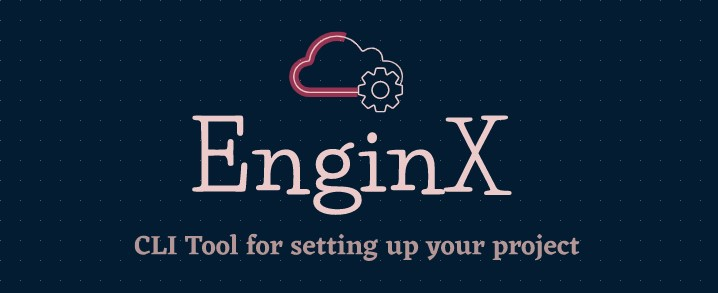

# EnginX
> CLI Tool for creating and setting up your projects

## 🤔 What is EnginX?
- Do you have to remember/google commands to create or start a project?
- Do you set up a cloned project manually?

We have a solution for you!

EnginX is a CLI tool to set up your project and start it without any manual work.

## ⬇ Usage
- Clone the repository using `git clone https://github.com/SwarupKharul/EnginX.git`
- Run EnginX using `source enginx`
- Alternatively you can run `enginx` by creating a environment variable `ENGINX_PATH` and setting it to the path of the EnginX directory
- Check the features of Turboot to learn more!
  
## 💪 Features
- One command to start/run any project
- No need to manually install dependencies

## 🙌 Contributions

- Feel Free to Open a PR/Issue for any feature or bug(s).
- Make sure you follow the [community guidelines](https://docs.github.com/en/github/site-policy/github-community-guidelines)!
- Have a feature request? Open an Issue!

## ⭐ Show your support

Give a ⭐ if this tool made your life easier!

Spread the word to your geek fellows to save their time!

## ⚖ License

Copyright 2021 Swarup Kharul

Licensed under MIT License : https://opensource.org/licenses/MIT

Made with ❤ and cups of coffee ☕

